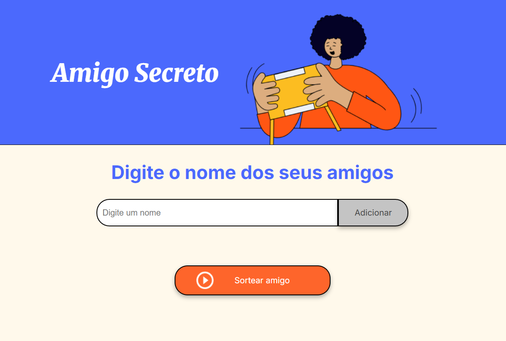
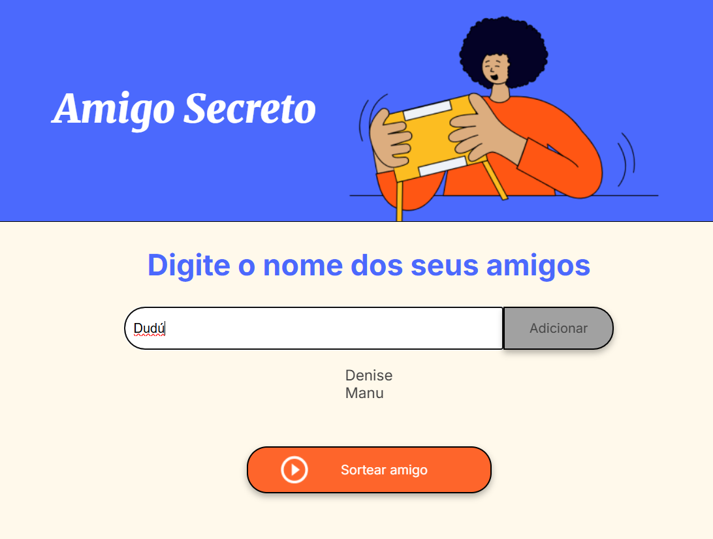
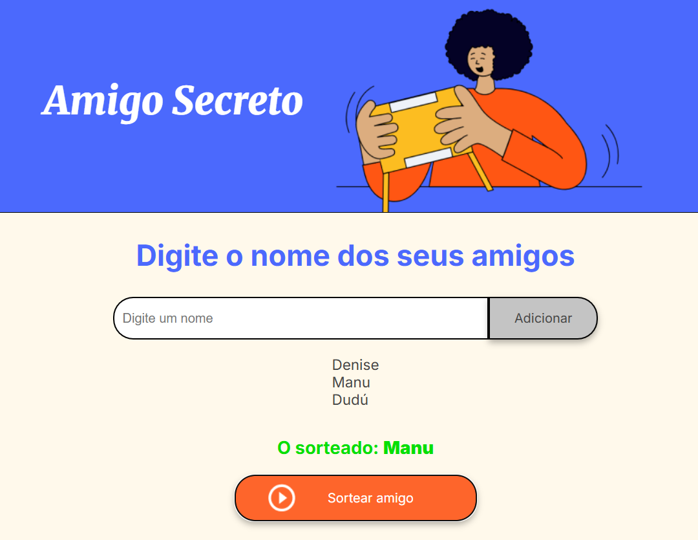

# 🎁 Amigo Secreto  

Projeto simples e interativo de sorteio de **Amigo Secreto**, desenvolvido em JavaScript, HTML e CSS.  
A aplicação permite adicionar nomes de participantes e realizar o sorteio de forma automática e justa.


## ✨ Funcionalidades  

- Adicionar nomes dos participantes.  
- Visualizar a lista de amigos adicionados.  
- Sortear automaticamente o "Amigo Secreto".  

## 📸 Demonstração  

### Tela inicial


### Adicionando participantes


### Sorteio realizado



## 💻 Tecnologias utilizadas  

- HTML5  
- CSS3  
- JavaScript (ES6+)  

## 🚀 Como executar o projeto  

1. Clone o repositório:  
   ```bash
   git clone https://github.com/Deh-prog/Challenge_Amigo-Secreto.git
2. Acesse a pasta do projeto: **cd amigo-secreto**
3. Abra o arquivo **index.html** no navegador.

## 🤝 Contribuições  

Contribuições são sempre bem-vindas!  
Sinta-se à vontade para abrir **issues** ou enviar um **pull request**.

## 📄 Licença  

Este projeto está sob a licença MIT.  

## 📬 Contato  

Feito com 💜 por [Denise Moreira](https://www.linkedin.com/in/denise-mmoreira).  
📧 Email: deh.mmoreira@gmail.com


 
